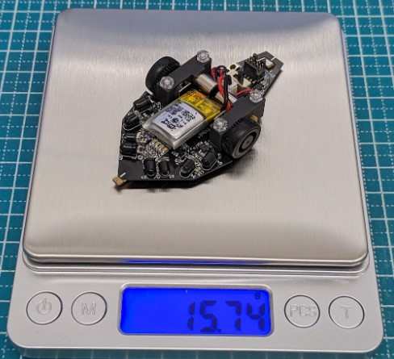

## 概要
___

「zirconia v.2.0」はマイクロマウスのチャンピオンが製作したオープンソースのマイクロマウスをnakagawaが改訂した版です。 
   
zirconiaの紹介はmastarブランチに書かれています。  
  

## 機能
___
 
各種インターフェースやセンサーの動作確認  

- マイコン各種機能(STM32F411)
- LED
- プッシュスイッチ
- モータ
- エンコーダ(MA730)
- IMU(ICM-42688-P)
- IRセンサ
  
機能の詳細についてはソフトマニュアルとサンプルコードのindex.hを参照して下さい。
 
## 動作環境
___
 
- 統合開発環境
    - STM32CubeIDE
    - Version :  1.15.0
    - URL : https://www.st.com/ja/development-tools/stm32cubeide.html

- フラッシュライター
	- STM32CubeProgrammer
	- Version : 2.16.0
 	- URL : https://www.st.com/ja/development-tools/stm32cubeprog.html

※ Versionにはサンプルプログラムを開発したときのものを記載してあります。  
　　基本的には最新版をインストールすべきだと思いますが、  
　　サンプルプログラムが動かない等の不具合がありましたら参考にして下さい。

## 構成
___
 
- hardware
    - 回路図やガーバーデータ、部品リストなどハードウェアデータ
- software
    - CubeMXで自動生成したソフトと本サンプルプログラム
    - Incフォルダ内のIndex.hにサンプルプログラムの使い方が記載されています
    - Srcフォルダ内にmain.cなどのサンプルプログラムが入っています
- ハードマニュアル
    - ハードウェアの作り方や構成について記載されています
- ソフトマニュアル
    - サンプルプログラムの導入や使い方について記載されています
 
## その他
 ___

__本サンプルコードではマイクロマウスとして迷路を完走させることはできません。__  
本サンプルコードの目的は、製作したハードウェアの動作確認であり、その副産物として、マイクロマウスとして使いやすいデバイスドライバが書かれています。  
  
あくまでもzirconiaは動くハードウェアを用意しただけなので、ソフトウェアは自力で頑張れる人向けです。電子工作やプログラミングのガチ初心者にはオススメしません。  
電子工作や組み込みプログラム入門として、マイクロマウスを始める場合には(株)アールティより販売されている学習キット[Pi:Co Classic3.4 ESP32-S3](https://rt-net.jp/products/pico-classic3-esp32)や[Pi:Co V2](https://rt-net.jp/products/pico-v2)がオススメです。
 
## 作者
___
 
[Noriaki Nakagawa](https://github.com/noriakinakagawa)  
zirconia_sample is licensed under the Apache License, Version2.0
 